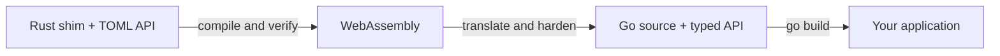

# Cocoon

[](https://github.com/darccio/cocoon/actions/workflows/quality.yml)
[](https://pkg.go.dev/dario.cat/cocoon/rt)
[](LICENSE)

**Rust libraries. Pure Go packages.**

Cocoon turns a Rust shim into a Go package you can import, build, and distribute
with ordinary Go tools. Declare the API in TOML, implement it in Rust, and Cocoon
compiles it through WebAssembly into Go source.

Applications consuming the generated package need only Go. Rust, Binaryen, and
the Wasm translator are tools for the package author; the generated package
runs without cgo, a Wasm engine, or native shared libraries.

- **Reuse Rust code:** expose functions, typed records, and stateful resources
  through a generated Go API.
- **Keep Go deployments simple:** check in generated sources and cross-compile
  with the Go toolchain.
- **Control the boundary:** declare host capabilities, bound inputs, outputs,
  and instance memory, and manage resources with explicit `Close` methods.
- **Reproduce builds:** pin the generator and toolchain, with source and artifact
  fingerprints recorded in `cocoon.lock.json`.

Cocoon is an early-stage project. Synchronous functions and resources are
implemented; async operations and HTTP support are planned. See the
[roadmap](docs/roadmap.md) for current work.

## Quick start

Use **Go 1.26 or newer**. Cocoon is published as `dario.cat/cocoon` starting with
`v0.2.0`. The checked-in Datadog example exposes Rust SQL and
trace obfuscation and DDSketch operations through a Go package. Try SQL
obfuscation in a new module:

```sh
mkdir cocoon-demo
cd cocoon-demo
go mod init example.com/cocoon-demo
go get dario.cat/cocoon/examples/datadog/go/dd@latest
```

Save this as `main.go`:

```go
package main

import (
	"context"
	"fmt"

	"dario.cat/cocoon/examples/datadog/go/dd"
)

func main() {
	library, err := dd.Open(dd.Options{Instances: 1})
	if err != nil {
		panic(err)
	}
	defer func() { _ = library.Close() }()

	query, err := library.ObfuscateSQL(
		context.Background(), "SELECT * FROM users WHERE id = 42",
	)
	if err != nil {
		panic(err)
	}
	fmt.Println(query)
}
```

```sh
CGO_ENABLED=0 go run .
```

Output:

```text
SELECT * FROM users WHERE id = ?
```

This uses the generated Go sources already included in Cocoon. You do not need
to install Rust or clone libdatadog to run it. Explore the
[Datadog API declarations](examples/datadog/cocoon.toml) and
[usage tests](examples/datadog/go/dd/dd_test.go) for trace and sketch examples.

## How it works



Cocoon generates both sides of the API boundary. Rust compiles the shim to
WebAssembly; Binaryen optimizes it; [wasm2go](https://github.com/ncruces/wasm2go)
translates it to Go. Cocoon verifies the module and hardens the translated code
before publishing the generated package.

The generated API handles encoding, instance pooling, resource ownership, and
fault reporting. It imports Cocoon's [`rt`](rt) support package, whose production
dependencies are all in Go's standard library. Wazero is used for differential
tests against the original Wasm, and is absent from production imports.

## Build your own package

Authors need Go **1.26+**, Rust **1.97.0**, Binaryen **133**, and wasm2go
**v0.4.16**. Install the pinned Rust and Binaryen tools using the
[build guide](docs/building.md#install-the-build-tools), and put Go's binary
installation directory on your `PATH`.

In a fresh directory, create an author module and install the CLI at the same
version as its Go dependency:

```sh
mkdir cocoon-workspace
cd cocoon-workspace
mkdir my-library
cd my-library
go mod init example.com/my-library
go get dario.cat/cocoon@latest
go get -tool github.com/ncruces/wasm2go@v0.4.16

COCOON_VERSION=$(go list -m -f '{{.Version}}' dario.cat/cocoon)
go install dario.cat/cocoon/cmd/cocoon@"$COCOON_VERSION"

git clone --branch "$COCOON_VERSION" --depth 1 \
  https://github.com/darccio/cocoon.git ../cocoon
cocoon init --name hello --guest ../cocoon/rust/cocoon-guest .
```

The sibling checkout supplies the matching Rust support crate. Keep that
version-pinned checkout beside your project for rebuilds; consumers need only
your generated Go package. `init` creates `cocoon.toml`, a standalone Cargo
workspace under `shim/`, and the generated API under `go/hello/`. It supplies an
echo implementation and refuses to overwrite existing authored files.

The function declaration in `cocoon.toml` describes the boundary:

```toml
[[func]]
name = "echo"
params = [{ name = "input", type = "string" }]
returns = "string"
fallible = true
```

The implementation lives in `shim/src/implementation.rs`:

```rust
#[derive(Default)]
pub struct Shim;

impl crate::cocoon_gen::API for Shim {
    fn echo(&mut self, input: String) -> cocoon_guest::Result<String> {
        Ok(input)
    }
}
```

Build and test the package:

```sh
cocoon doctor
cocoon build
go mod tidy
CGO_ENABLED=0 go test ./go/hello/...
```

Your application can now import `example.com/my-library/go/hello` and call
`library.Echo(ctx, "hello")` after opening it with `hello.Open(hello.Options{})`.
The shim implementation is compiled with `forbid(unsafe_code)`; pointer handling
belongs to Cocoon's generated glue and guest support crate.

When you change the API, edit `cocoon.toml`, run `cocoon gen`, implement the
updated Rust trait, and run `cocoon build` again. Keep the manifest, authored
shim, Cargo lockfile, generated Go sources and tests, reference Wasm, and
`cocoon.lock.json` together in version control. The
[build guide](docs/building.md) covers rebuilding, distributing, and verifying
packages.

| Command | Purpose |
| --- | --- |
| `cocoon init` | Create a shim and API inside an existing Go module. |
| `cocoon gen` | Generate Rust contracts and the Go facade from the manifest. |
| `cocoon build` | Compile, verify, translate, and generate the package and tests. |
| `cocoon verify path/to/module.wasm` | Verify a Wasm module against the manifest. |
| `cocoon doctor` | Check that the pinned build tools are available. |

`gen`, `build`, `verify`, and `doctor` use `cocoon.toml` in the current directory;
pass `--manifest path/to/cocoon.toml` to select another project.

## Behavior and limits

Reuse a library across calls and close it when finished. Stateless operations
use a bounded instance pool; stateful resources belong to one serialized
instance. Keep resource wrappers as pointers and close them before closing
their library. Library shutdown rejects new work and waits for admitted calls.

Cocoon is intended for trusted, reviewed Rust payloads. Crates must build for
`wasm32-unknown-unknown`; the supported host capabilities are logging, entropy,
and a clock. WASI, async operations, HTTP, and guest threads are not supported.

Execution is synchronous. Context cancellation can prevent a call from
starting or stop waiting for a pool slot; it cannot interrupt an executing
guest. Recoverable guest traps poison the instance and invalidate its handles.
Fatal Go stack exhaustion and process out-of-memory failures cannot be
recovered. Memory limits apply to each instance, not the entire process.
See [ABI and lifecycle](docs/abi.md) and the
[design review](docs/design-review.md) for the full contracts.

## Documentation

| Guide | Contents |
| --- | --- |
| [Building and distributing packages](docs/building.md) | Tool setup, generated files, reproducibility, and example rebuilds. |
| [ABI and lifecycle](docs/abi.md) | Types, encoding, ownership, errors, and shutdown. |
| [Design review](docs/design-review.md) | Boundary checks, fault handling, and capability restrictions. |
| [Performance](docs/performance.md) | Benchmarks, measurements, and PGO work. |
| [Roadmap](docs/roadmap.md) | Current implementation status and upcoming work. |
| [Dependency licenses](tools/licenses/README.md) | Inventory scope, regeneration, and attribution review. |

## Contributing and support

Bug reports, small reproducible examples, documentation fixes, and pull requests
are welcome. Use [GitHub issues](https://github.com/darccio/cocoon/issues) for
questions, bugs, and feature proposals. For build problems, include your Go
version, platform, `cocoon doctor` output, and the failing command.

To work on Cocoon itself, clone the repository and follow the
[contributor checks](docs/building.md#contributor-checks). Changes to generated
code should include the source or generator change that produced them.

## License

Cocoon's original code is licensed under [Apache-2.0](LICENSE). Dependencies and
generated payloads retain their upstream licenses.
[LICENSE-3rdparty.csv](LICENSE-3rdparty.csv) identifies resolved dependencies and
license evidence; [LICENSE-3rdparty.txt](LICENSE-3rdparty.txt) preserves upstream
license and attribution texts, including the Rust standard library.

Regenerate the inventory with `make licenses` and validate it with
`make licenses-check`. CI checks both files. When distributing a generated
package, retain the license and attribution notices that apply to its Rust
inputs and embedded payload as well as Cocoon's [LICENSE](LICENSE) and
[NOTICE](NOTICE).
